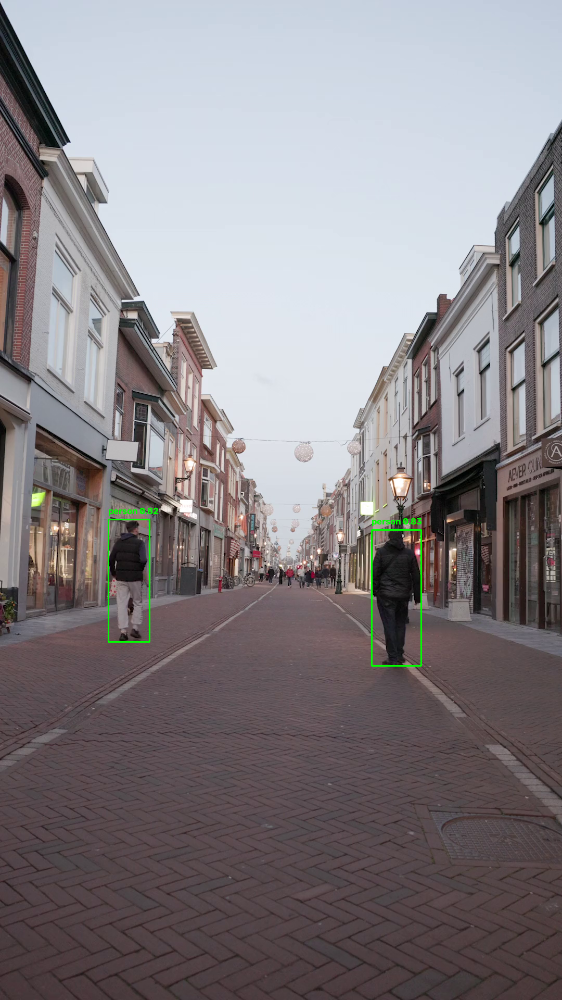
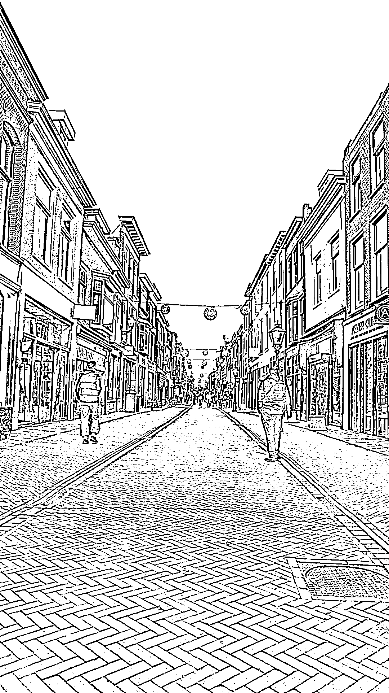

# Real-Time CV Object Detection Pipeline

A computer vision pipeline that detects and tracks people in video footage, combining a pre-trained YOLOv8 model with classical (non-AI) image processing for comparison.

## What it does
- Reads a video frame by frame (OpenCV `VideoCapture`) and writes an annotated output video (`VideoWriter`)
- Runs **YOLOv8n** object detection on every frame, drawing bounding boxes, class labels, and confidence scores
- Overlays a live running count of detected people per frame
- Applies a **classical image processing** pipeline (grayscale → Gaussian blur → adaptive thresholding) as a non-AI comparison
- Logs per-frame metrics (people detected, average confidence, processing time, FPS) to `frame_metrics.csv`

## Results
- 218 frames processed, ~20 FPS steady-state performance
- Average detection confidence: 0.71
- Found and documented a model **cold-start effect**: frame 1 took 5.18s to process vs. ~0.05s for every frame after, due to YOLO's one-time internal initialization

**YOLOv8 detection output:**



**Classical image processing output (Gaussian blur + adaptive thresholding):**



Full analysis, figures, and discussion are in the accompanying whitepaper.

## How to run
```bash
pip install opencv-python ultralytics matplotlib numpy pandas
python cv_pipeline.py
```
Place your own video as `sample_video.mp4` in the project folder before running. The YOLOv8n weights (`yolov8n.pt`) download automatically on first run.
